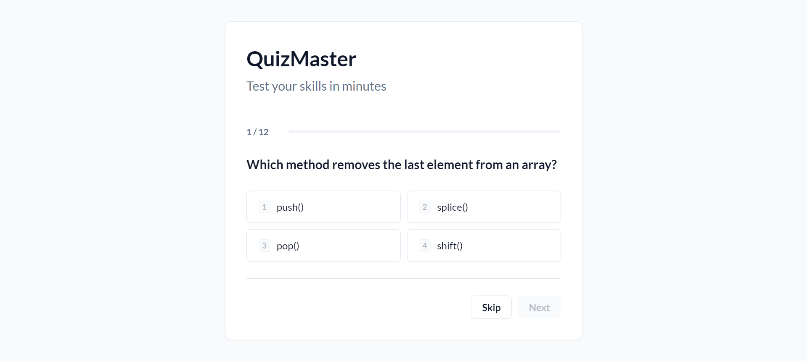

# QuizMaster - Professional Quiz Application

A modern, responsive, and accessible quiz application built with vanilla HTML, CSS, and JavaScript. Designed with a clean, corporate aesthetic and mobile-first approach.



[**🚀 View Live Demo**](https://your-app-url.vercel.app/)

## Features

- **Professional UI**: Clean Slate-based color palette, consistent typography (Lato), and distraction-free layout.
- **Dynamic Quiz Engine**: 
  - Randomly shuffles questions and options.
  - Supports multiple categories (JavaScript, Web Basics).
  - Tracks scores and high scores using `localStorage`.
- **Interactive Feedback**: 
  - Instant validation of answers.
  - Detailed review section at the end of the quiz.
  - Confetti celebration for high scores (>60%).
- **Accessibility**: 
  - Semantic HTML structure.
  - Keyboard navigation (Number keys 1-4, Enter, Escape).
  - ARIA live regions for screen readers.
- **Responsive Design**: Optimized for desktops, tablets, and mobile devices.

## Project Structure

```
/
├── index.html      # Main application shell
├── style.css       # Professional styling variables and rules
├── script.js       # Game logic, state management, and DOM manipulation
└── screenshot.png  # Application preview
```

## Getting Started

1. Clone or download this repository.
2. Open `index.html` in any modern web browser.
3. No build steps or server required.

## Keyboard Shortcuts

- **1 - 4**: Select Option
- **Enter**: Confirm Selection / Next Question
- **Esc**: Skip Question

## Technologies

- HTML5
- CSS3 (Variables, Flexbox, Grid)
- Vanilla JavaScript (ES6+)
- Google Fonts (Lato)

